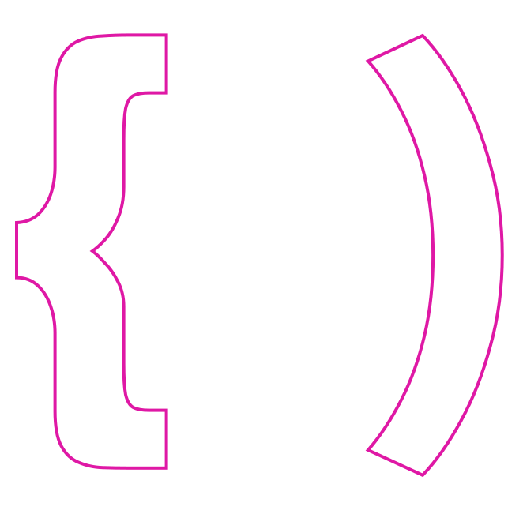

 

  

 

<h1 align="center" style="color: white"> <strong style="color: purple"> < </strong> 👋 I'm Aline Viana <strong style="color: purple"> /> </strong> </h1>
<h3 align="center">Software Developer</h3>
 

> ### About me: 

#### ° 👩🏻‍💻 I'm a Software Developer
#### ° 🔭 I’m currently working at **Oficina5**
#### ° 💻 Languages and Tools:

#### ° 📫 Connect with me:  
                 
 

 

